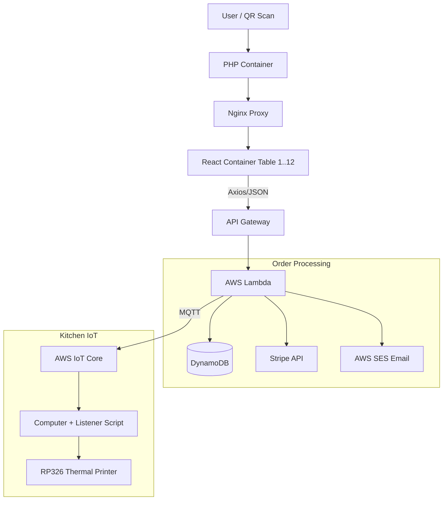

# TableTap

   

> **TableTap** is a serverless, containerized QR code ordering system facilitating seamless dine-in and takeout experiences. It connects customers directly to the kitchen via real-time MQTT printing and handles secure payments via Stripe.

## 📖 Table of Contents
- [About the Project](#-about-the-project)
- [System Architecture](#-system-architecture)
- [Tech Stack](#-tech-stack)
- [Environment Configuration](#-environment-configuration)
- [Workflow](#-workflow)
- [Key Features](#-key-features)
- [Hardware & IoT Integration](#-hardware--iot-integration)
- [Data Models](#-data-models-dynamodb)
- [Architecture Diagram](#-architecture-diagram)

## 🧐 About the Project

TableTap modernizes the restaurant ordering flow by replacing physical menus with dynamic QR codes. The system eliminates the need for servers to take initial orders, allowing the kitchen to receive tickets instantly.

The system supports two distinct modes:
1.  **Dine-In:** Customers scan a table-specific QR code, browse the menu, and send orders directly to the kitchen printer.
2.  **Takeout:** Customers browse remotely, pay upfront via Stripe, and receive an automated email receipt upon successful transaction.

The application relies on a hybrid architecture using **AWS Serverless** components for backend logic and data, and **Docker** containers for frontend isolation and routing.

## 🏗 System Architecture

The infrastructure is composed of three main pillars:

### 1. The Frontend (Containerized)
*   **Dynamic QR Codes:** A PHP container handles the initial scan, directing users to the correct session URL.
*   **Nginx Reverse Proxy:** Routes traffic to the appropriate container.
*   **Per-Table Isolation:** The application runs ~12 separate Docker containers (one per table + takeout) to manage state and sessions independently.
*   **Updates:** GitHub Actions handles CI/CD, updating container images on the Linux Ubuntu server automatically on push.

### 2. The Backend (AWS Serverless)
*   **API Gateway & Lambda:** Receives cart payloads via Axios. The Lambda function (`lambda_function.py`) acts as the central controller.
*   **Stripe Integration:** Validates webhooks for takeout orders to ensure payment success before processing.
*   **Data Persistence:** **DynamoDB** stores all order details, customer info, and transaction timestamps.
*   **Notifications:** **AWS SES** sends formatted HTML email receipts to takeout customers using a custom template.

### 3. The IoT Layer (Kitchen)
*   **AWS IoT Core (MQTT):** Lambda publishes approved orders to a secure MQTT topic.
*   **Python Listener:** A script running on-premise listens to the subscription topic.
*   **Thermal Printing:** Uses the `python-escpos` library to parse the JSON payload and print physical tickets for the chefs.

## 🛠 Tech Stack

**Frontend:**
*   React + Vite
*   Tailwind CSS
*   Axios (HTTP Requests)

**Backend & Cloud:**
*   Python 3.10 (AWS Lambda)
*   AWS DynamoDB (NoSQL Database)
*   AWS IoT Core (MQTT Messaging)
*   AWS SES (Simple Email Service)
*   Stripe API (Payments & Webhooks)

**DevOps & Infrastructure:**
*   Docker & Docker Compose
*   Nginx (Reverse Proxy)
*   GitHub Actions (CI/CD)
*   Linux Ubuntu Server



## ⚙ Environment Configuration

The Lambda function requires the following environment variables to operate:

| Variable | Description |
| :--- | :--- |
| `STRIPE_SECRET_KEY` | Secret key for initializing Stripe API calls. |
| `STRIPE_WEBHOOK_SECRET` | Used to verify that incoming webhooks are genuinely from Stripe. |
| `SENDER_EMAIL` | The verified identity email in AWS SES used to send receipts. |
| `DYNAMODB_TABLE_NAME` | The name of the DynamoDB table for order persistence. |
| `PRINTER_TOPIC` | The MQTT topic string that the kitchen printer subscribes to. |

## 🔄 Workflow

1.  **User Scan:** User scans QR code -> PHP Container Redirect -> Nginx -> React Container.
2.  **Order Submission:** User builds cart and clicks "Order".
3.  **Processing:**
    *   *If Dine-In:* Payload sent directly to API Gateway.
    *   *If Takeout:* User pays via Stripe. Stripe Webhook triggers API Gateway.
4.  **Lambda Logic:**
    *   Saves order to DynamoDB.
    *   Publishes payload to AWS IoT Core.
    *   *(Takeout Only)* Generates HTML from `emailtemplate.html` and sends via SES.
5.  **Fulfillment:** Local Computer script detects MQTT message -> Prints Ticket on RP326 -> Kitchen prepares food.

## ✨ Key Features

*   **Hybrid Ordering System:** Seamlessly handles both "pay-later" Dine-In orders and "pay-now" Stripe Takeout orders in a single codebase.
*   **Real-Time Kitchen Bridge:** Sub-second communication between the web app and the physical kitchen printer using AWS IoT MQTT.
*   **Server-Driven UI (Headless CMS):** The frontend fetches menu items dynamically from DynamoDB. Restaurant staff can update prices, descriptions, or "Daily Specials" on the backend without redeploying the HTML/Frontend code.
*   **Automated Receipts:** Generates dynamic HTML email receipts including itemized lists, tax calculations, and payment method badges (Apple Pay, Visa, Mastercard).
*   **Smart Station Routing:** The system distinguishes between items prepared in the "front" (Sushi Bar) vs the "back" (Kitchen) based on item metadata.

## 🖨️ Hardware & IoT Integration

The bridge between the cloud and the physical kitchen is handled by a lightweight listener node.

*   **Printer:** RP326 80mm Thermal Receipt Printer (Connected via USB/Network).
*   **Listener Node:** A dedicated computer running a Python script that subscribes to the AWS IoT MQTT topic.
*   **Driver:** Uses the `python-escpos` library to convert JSON payloads into ESC/POS printer commands.

## 💾 Data Models (DynamoDB)

The application uses DynamoDB to store Menu Items and Orders. The schema leverages DynamoDB JSON format to ensure strict typing (Strings vs Numbers).

### 1. Menu Item Schema
Used to render the frontend menu dynamically.

```json
{
  "ItemNumber": { "N": "173" },
  "ItemName": { "S": "Daily Special B" },
  "Category": { "S": "Daily Special" },
  "Description": { "S": "Spicy Tuna (6 pcs) and Spicy Salmon (6 pcs)" },
  "Price": { "S": "14.95" },
  "Location": { "S": "front" } 
}
